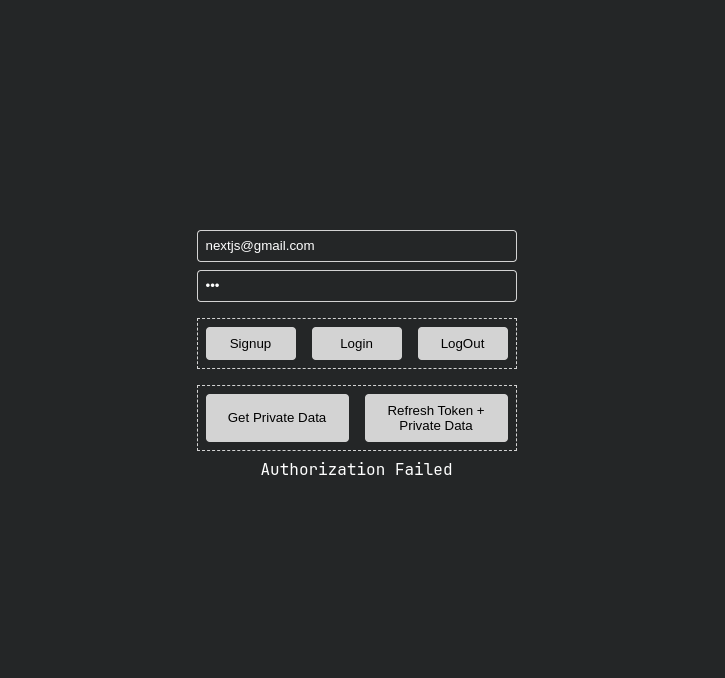

# MERN stack JWT authorization tutorial



## Pre-requisite

- MongoDB (mongod version v7.0.0)
- Node 18
- Nodemon

## Installtion

If you use nvm. This project has a .nvmrc. You may want to sync with the projects node version.

```bash
nvm use
npm install
```

## Start the app

```bash
nodemon server.js
```

- Goto http://localhost:8998/

### Self Notes

- [ ] Dockerize mongodb inside volumes
- [ ] Convert to plug and play micro auth server
- [ ] Enhance jwt signing using ip address
- [ ] Blacklisting users
- [ ] Add Envalid.js to validate .env
- [ ] Fix hotreloading integration issue bcoz of nodemon
